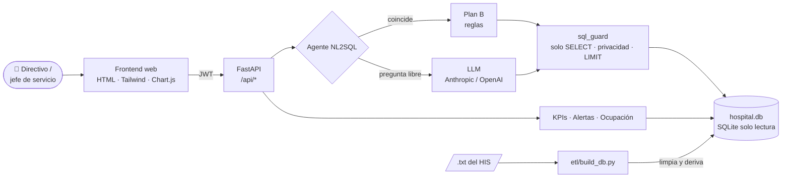

<div align="center">


# Asistente IA de Gestión Hospitalaria

**Pregúntale a los datos del hospital en lenguaje natural y recibe la respuesta, la gráfica y la recomendación.**

_Hackathon de Programación · Campus Party FUP 2026_

[](https://hackathon2026fuphslv-production.up.railway.app)


<sub><i>¡Pensando en ti, doy lo mejor de mí!</i></sub>

</div>

---

## 📑 Contenido

- [El reto](#-el-reto)
- [Qué hace](#-qué-hace)
- [Arquitectura](#-arquitectura)
- [Preguntas de la demo](#-preguntas-de-la-demo)
- [Cómo ejecutar](#-cómo-ejecutar)
- [Despliegue en Railway](#-despliegue-en-railway)
- [Seguridad, roles e informes](#-seguridad-roles-e-informes)
- [Tecnologías](#-tecnologías)
- [Documentación](#-documentación)
- [Limitaciones](#-limitaciones)
- [Equipo](#-equipo)

---

## 🏥 El reto

El **Hospital Susana López de Valencia** (Popayán; mediana complejidad, fuerte en gineco-obstetricia, pediatría y
UCI neonatal) atiende ~500 pacientes diarios, pero la información de camas, tiempos de espera, quirófanos,
medicamentos y citas está dispersa en sistemas y hojas de cálculo desconectadas. Los directivos dependen de
reportes manuales a TI, y eso retrasa decisiones críticas.

**Nuestra solución:** un agente **NL2SQL** que convierte preguntas en consultas SQL seguras sobre una base
unificada, acompañado de un dashboard de KPIs y alertas automáticas, con un **plan B por reglas** para que la
demo nunca se caiga.

## ✨ Qué hace

| | Módulo | Descripción |
|:-:|---|---|
| 💬 | **Asistente IA** | Pregunta en español → SQL validado → respuesta corta + tabla + gráfico + SQL visible + recomendaciones |
| 📊 | **Dashboard de KPIs** | Ocupación de camas, tiempos de espera por triage, eficiencia de quirófanos, rotación de medicamentos y demanda por especialidad |
| 🛏️ | **Ocupación** | Censo diario por servicio y subservicio (UCI Adultos/Neonatal/Pediátrica, Intermedios, Hospitalización…) |
| 🚨 | **Alertas** | Desabastecimiento, vencimientos, sobreocupación, esperas fuera de meta con causa raíz, reprogramaciones de cirugía |
| 💊 | **Medicamentos** | Días de inventario, stock crítico y consumo diario real |
| 📥 | **Importar datos** | Carga de los extractos del HIS para regenerar la base |
| 🔐 | **Permisos por rol** | Usuarios y matriz rol × módulo administrables por Dirección |
| 📄 | **Informe PDF** | Descarga de cada respuesta como informe con sección de auditoría encadenada con SHA-256 |

## 🧭 Arquitectura



Detalle de componentes, flujo del agente y contrato de la API en [docs/01-arquitectura.md](docs/01-arquitectura.md).

## 🎯 Preguntas de la demo

"Hoy" es el **21 de septiembre de 2026**, último día con ingresos en los datos.

| # | Pregunta | Respuesta |
|:-:|---|---|
| 1 | ¿Cuántas camas de UCI están ocupadas hoy? | **27 de 46** (58,7 %); 73 % sobre camas físicas |
| 2 | ¿Cuáles son los medicamentos con menos de 5 días de inventario? | **35 medicamentos** (inventario simulado) |
| 3 | ¿Cuál es el tiempo de espera promedio en urgencias en la última semana? | **58,6 min** en 888 atenciones, desglosado por triage |
| 4 | ¿Qué servicio tiene más pacientes ingresados este mes? | **Urgencias (1.169)**, luego Pediatría (409) y Hosp. Adultos (401) |

## 🚀 Cómo ejecutar

```bash
# 1. Entorno
python -m venv .venv
.venv\Scripts\activate            # Windows  (Linux/macOS: source .venv/bin/activate)
pip install -r requirements.txt

# 2. Credenciales
copy .env.example .env            # completar LLM_PROVIDER, la API key y AUTH_* (ver abajo)

# 3. Base de datos (~20 s)
#    Los 7 .txt crudos del HIS NO están en el repo: copiarlos en DATOS/ antes de este paso
python etl/build_db.py --raw "DATOS" --out data/hospital.db

# 4. Aplicación
uvicorn app.main:app --reload     # http://localhost:8000  (documentación de la API en /docs)

# 5. Pruebas (guard SQL, agente, login, KPIs, alertas y las 4 preguntas de la demo)
python -m pytest -q
```

> [!NOTE]
> La primera carga de KPIs tarda ~20 s (se precalienta sola al arrancar); después es instantánea.

<details>
<summary><b>⚙️ Variables de entorno (<code>.env</code>)</b></summary>

| Variable | Uso | Default |
|----------|-----|---------|
| `LLM_PROVIDER` | `anthropic` \| `openai` \| `none` (solo reglas) | `none` |
| `LLM_MODEL` | Modelo a usar (opcional) | `claude-sonnet-5` / `gpt-4o-mini` |
| `ANTHROPIC_API_KEY` / `OPENAI_API_KEY` | Clave del proveedor | — |
| `DB_PATH` | Base SQLite | `data/hospital.db` |
| `AUTH_USERNAME` | Usuario del panel (acepta también `usuario@hosusana.gov.co`) | `admin` |
| `AUTH_PASSWORD` | Contraseña del panel | `hslv2026` (**solo demo**, cámbiela) |
| `AUTH_SECRET` | Clave para firmar los tokens JWT (32+ caracteres aleatorios) | se genera al arrancar |
| `ACCESS_PATH` | Archivo de usuarios y matriz de permisos | `data/access.json` |
| `AUDIT_PATH` | Bitácora de auditoría de consultas e informes | `data/audit.jsonl` |

Sin `AUTH_SECRET`, los tokens dejan de valer al reiniciar el servidor (hay que volver a iniciar sesión).

</details>

## ☁️ Despliegue en Railway

La app corre en Railway con el [Dockerfile](Dockerfile): **<https://hackathon2026fuphslv-production.up.railway.app>**

La base de datos (~290 MB) y los `.txt` crudos **no están en GitHub**: son datos del hospital y superan los límites
de tamaño. Por eso se despliega desde un PC que tenga los datos, con Railway CLI, y la imagen regenera
`data/hospital.db` con el ETL durante el build.

```powershell
# Requisitos: Node.js y los 7 .txt crudos en DATOS/
npm i -g @railway/cli
railway login
railway link                      # elegir el proyecto Hackathon2026FupHslv (o `railway init` para uno nuevo)

python deploy/pack_raw.py         # comprime DATOS/*.txt en deploy/raw/*.txt.gz (~21 MB; ignorado en git)
railway up --no-gitignore         # sube el código + deploy/raw/ y construye la imagen
```

> [!IMPORTANT]
> **`--no-gitignore` es obligatorio:** sin él no se sube `deploy/raw/`. Lo que no debe subirse (`.env`, `.venv`,
> `DATOS/`, `data/`, tests) está en [.railwayignore](.railwayignore). `railway up` admite ~40 MB por subida; por eso
> se suben los crudos comprimidos y no la base de datos.

- **Variables** (servicio → *Variables*): `LLM_PROVIDER`, `ANTHROPIC_API_KEY` u `OPENAI_API_KEY`,
  `AUTH_PASSWORD` (distinta a la de demo) y `AUTH_SECRET`. Railway redespliega al guardarlas. No hace falta `PORT`:
  Railway lo asigna y el contenedor lo usa.
- **URL pública:** servicio → *Settings → Networking → Generate Domain* (o `railway domain`).
- **Verificar:** `https://<dominio>/api/health` debe responder `{"status":"ok","db":true,...}`.
- **Actualizar:** los cambios de código no se despliegan solos; repetir `railway up --no-gitignore` desde `main`
  actualizado. Si cambian el ETL o los crudos, correr antes `python deploy/pack_raw.py`.
- **Estado efímero:** `data/access.json` (usuarios y permisos) y `data/audit.jsonl` (bitácora) se reinician en cada
  redespliegue. Para conservarlos, montar un volumen de Railway y apuntar `ACCESS_PATH`/`AUDIT_PATH` a él.

## 🔐 Seguridad, roles e informes

**Seguridad del agente:** base abierta en **solo lectura**, una sola sentencia `SELECT`/`WITH`, `LIMIT` forzado y
timeout por consulta. El resultado nunca incluye identificadores de paciente, fecha de nacimiento ni cama, y el
diagnóstico específico solo se permite en consultas agregadas. Las credenciales viven solo en `.env`.

### Permisos por rol

| Rol | Acceso por defecto |
|-----|--------------------|
| **Gerencia / Dirección** | Todos los módulos + pestaña **Permisos** (usuarios y matriz rol × módulo) |
| **Jefe de servicio** | Dashboard, Ocupación, Asistente IA, Alertas y Medicamentos; queda asociado a un servicio |

El usuario del `.env` es siempre Dirección. Desde **Permisos** crea usuarios (contraseña con hash PBKDF2),
los activa o desactiva, les cambia el rol y marca qué módulos ve cada rol. Los cambios aplican de inmediato:
el backend responde 403 a los módulos no permitidos y el panel oculta sus pestañas.

### Informe PDF con auditoría (solo Gerencia / Dirección)

Al final de cada respuesta con datos, el asistente pregunta **"¿Quieres descargar la información en un PDF tipo
informe?"**. Con **Sí** se descarga un PDF con la pregunta, la respuesta, la gráfica, la tabla completa, las
recomendaciones, el SQL ejecutado y una sección de **auditoría**: usuario y rol, fecha y hora, motor (IA o reglas),
controles de seguridad aplicados, huella SHA-256 del resultado, integridad de la bitácora e historial reciente.

- Exclusivo de Dirección: el módulo `reports` es fijo por rol (ni la matriz de permisos lo habilita a jefes de servicio).
- El PDF se arma en el servidor (reportlab) solo con lo registrado en la bitácora `data/audit.jsonl` (`AUDIT_PATH`).
  Cada consulta (respondida o rechazada) y cada descarga queda registrada, encadenada con SHA-256: si alguien edita
  o borra una línea, el siguiente informe muestra la alerta "la bitácora fue modificada".

## 🛠️ Tecnologías

| Capa | Tecnologías |
|---|---|
| Datos | Python 3.11+ · pandas · SQLite |
| Backend | FastAPI · Uvicorn · PyJWT · reportlab (PDF) |
| IA | Anthropic Claude / OpenAI (intercambiable) + plan B por reglas |
| Frontend | HTML · Tailwind CSS · Chart.js (sin build step) |
| Despliegue | Docker · Railway |
| Gestión | Git / GitHub · GitHub Projects |

Justificación de cada tecnología en [docs/02-tecnologias.md](docs/02-tecnologias.md).

## 📚 Documentación

| Documento | Contenido |
|-----------|-----------|
| [docs/01-arquitectura.md](docs/01-arquitectura.md) | Componentes, flujo del agente, contrato API, patrones, seguridad |
| [docs/02-tecnologias.md](docs/02-tecnologias.md) | Stack y justificación de cada tecnología |
| [docs/03-metodologia.md](docs/03-metodologia.md) | Roles, cronograma por sprints, flujo Git, DoD, riesgos |
| [CLAUDE.md](CLAUDE.md) | Contexto técnico completo: esquema de datos, KPIs, reglas del agente |

## ⚠️ Limitaciones

Las decimos en la demo, no las escondemos:

- **Inventario de medicamentos simulado:** los datos no traen stock ni vencimiento; el consumo diario sí es real.
- **Capacidad de camas estimada** por camas distintas observadas; reemplazable por la real.
- **Servicio del ingreso = cama registrada:** los traslados internos no se ven, así que la ocupación histórica de UCI
  está subestimada; la de "hoy" es la más confiable.
- **Cirugías sin fecha ni quirófano:** solo el 31 % cruza con ingresos; "realizada" = procedimiento cobrado.
- **Datos hasta el 21 de septiembre de 2026** (septiembre incompleto).

Detalle en [docs/01-arquitectura.md](docs/01-arquitectura.md#8-limitaciones-conocidas-se-dicen-en-la-demo).

## 👥 Equipo

| Integrante | Rol | Aportes principales |
|------------|-----|---------------------|
| **Yefry Esteban Astaiza Solano** | Agente IA y Backend | Estructura del backend y ETL de datos, agente NL2SQL con glosario, login y cliente de la API |
| **Laura Ximena Cuellar Yara** | Dashboard y KPIs | Módulo dashboard (interfaz, backend y datos), sección de importar datos, pruebas automatizadas del dashboard |
| **Ana Maria Tulande Chantre** | Seguridad, informes y despliegue | Permisos por rol, informe PDF con auditoría, prompt del asistente IA, login, documentación y despliegue en Railway |

<div align="center">

---

Hecho con 💚 en Popayán para el **Hospital Susana López de Valencia E.S.E.**

</div>
