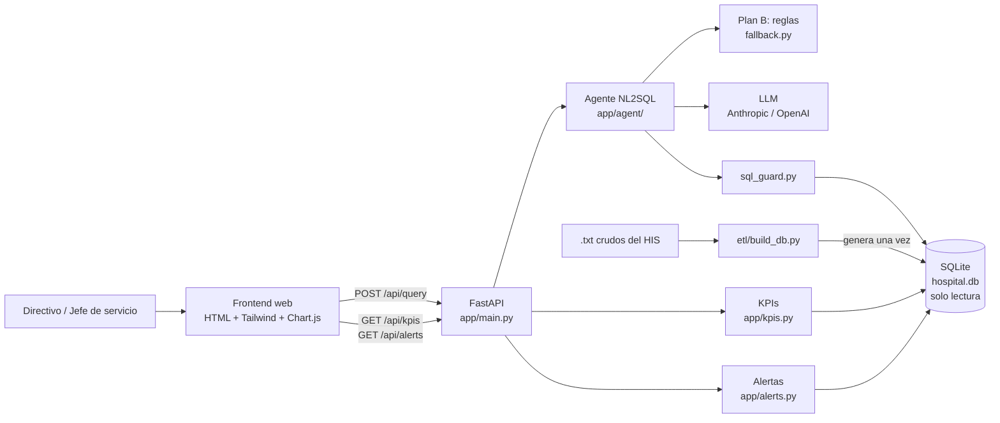
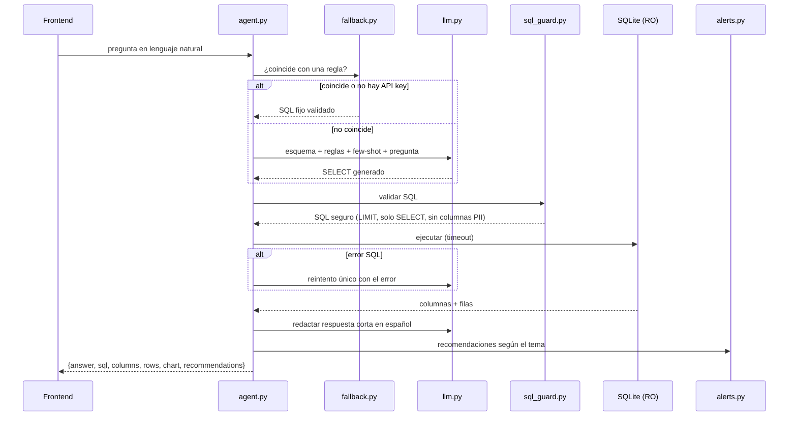
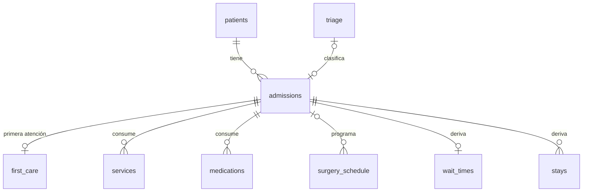

# Arquitectura — Asistente IA de Gestión Hospitalaria (HSLV)

**Decisión:** monolito modular en Python (FastAPI) que sirve la API y el frontend estático, con un agente NL2SQL
de dos rutas (reglas → LLM) sobre una base SQLite de solo lectura generada por un ETL.

Una sola aplicación, un solo proceso, un solo comando para correr. En 8 horas, cada pieza de infraestructura
extra es tiempo que no se invierte en la demo.

---

## 1. Vista general



| Capa | Responsabilidad | Módulo |
|------|-----------------|--------|
| Presentación | Chat, dashboard, tablas y gráficos | `web/` |
| API | Rutas HTTP, validación de entrada, serialización | `app/main.py` |
| Aplicación | Orquestar pregunta → SQL → datos → respuesta | `app/agent/agent.py`, `app/kpis.py`, `app/alerts.py` |
| Seguridad | Validar SQL, bloquear escritura y columnas sensibles | `app/agent/sql_guard.py` |
| Infraestructura | Conexión SQLite RO, clientes LLM | `app/db.py`, `app/agent/llm.py` |
| Datos | Limpieza y tablas derivadas | `etl/build_db.py` → `data/hospital.db` |

**Regla de dependencias:** las flechas van de izquierda a derecha. `web/` nunca toca la BD; el agente nunca lee `.txt`.

---

## 2. Flujo del agente NL2SQL (corazón del producto)



**Por qué el plan B va primero:** las 4 preguntas de la demo se resuelven por reglas, con SQL probado.
Si el LLM falla, se cae la red o se agota la cuota, la demo sigue funcionando. El LLM cubre la "cola larga".

---

## 3. Contrato de la API

Este contrato es lo primero que se acuerda: permite que frontend y backend trabajen en paralelo con datos simulados.

### `POST /api/query`

```json
// Request
{ "question": "¿Cuántas camas de UCI están ocupadas hoy?" }

// Response 200
{
  "answer": "Hoy hay 27 de 46 camas de UCI ocupadas (58,7%); 73% sobre camas físicas.",
  "sql": "SELECT service, occupied_beds, ... FROM v_occupancy_daily WHERE ...",
  "source": "rules",                 // "rules" | "llm"
  "columns": ["service", "occupied_beds", "capacity_beds", "occupancy_pct"],
  "rows": [["UCI", 27, 46, 58.7]],
  "chart": { "type": "bar", "x": "service", "y": "occupied_beds" },   // bar | line | pie | none
  "recommendations": ["Ocupación física de UCI en 73%: vigilar ingresos del turno noche."]
}

// Response 400 (pregunta vacía, SQL rechazado, datos personales)
{ "error": "La pregunta solicita datos personales y no puede responderse." }
```

### `GET /api/kpis`

```json
{
  "reference_date": "2026-09-21",
  "cards": [
    { "id": "occupancy_today", "label": "Ocupación hoy", "value": 0.0, "unit": "%" },
    { "id": "avg_wait_7d",     "label": "Espera promedio urgencias (7 días)", "value": 58.6, "unit": "min" },
    { "id": "critical_stock",  "label": "Medicamentos < 5 días", "value": 35, "unit": "" },
    { "id": "surgery_perf",    "label": "Cirugías realizadas", "value": 0.0, "unit": "%" }
  ],
  "series": {
    "occupancy_daily":       { "labels": ["2026-09-15"], "datasets": [{ "label": "UCI", "data": [55.0] }] },
    "surgery":               { "labels": ["Programadas", "Realizadas"], "data": [0, 0] },
    "admissions_by_service": { "labels": ["Urgencias"], "data": [1169] },
    "top_medications":       { "labels": ["..."], "data": [0] }
  },
  "medications_table": [
    { "item_name": "...", "stock_units": 0, "avg_daily_consumption": 0.0, "days_of_inventory": 0.0, "expiry_date": "2026-10-15" }
  ]
}
```

> **Fuente de verdad del contrato:** el frontend ya existe con `mockData` en `web/app.js`. Si la forma de ese
> `mockData` difiere de lo escrito aquí, **manda el `mockData`** y se actualiza este documento. El backend
> devuelve exactamente esa forma para que la integración sea cambiar mock por `fetch`.

### `GET /api/alerts`

```json
[
  { "type": "stock", "severity": "critical", "title": "Reabastecer X", "detail": "Quedan 1,4 días (consumo diario 12,3)" }
]
```

`severity`: `critical` | `warning` | `info`. `type`: `stock` | `expiry` | `occupancy` | `wait_time` | `surgery` | `forecast`.

### `GET /api/health`

`{ "status": "ok", "db": true, "llm_provider": "anthropic", "reference_date": "2026-09-21" }`

> Los valores `0.0` son de ejemplo para el mock del frontend; los reales salen de la BD.

---

## 3.1 Frontend (`web/`)

Ya construido con datos mock. Una sola página, sin framework ni build step (Tailwind y Chart.js por CDN).

| Componente | Endpoint que lo alimenta |
|------------|--------------------------|
| Login de demo | — (solo frontend) |
| 4 tarjetas KPI | `GET /api/kpis` → `cards` |
| Gráfico ocupación UCI | `GET /api/kpis` → `series.occupancy_daily` |
| Gráfico quirófanos | `GET /api/kpis` → `series.surgery` |
| Ingresos por servicio | `GET /api/kpis` → `series.admissions_by_service` |
| Tabla de medicamentos + buscador | `GET /api/kpis` → `medications_table` (filtro en el navegador) |
| Panel de alertas | `GET /api/alerts` |
| Chat: respuesta, tabla, gráfico, SQL en `<details>`, recomendaciones | `POST /api/query` |

FastAPI sirve `web/` en `/` y la API en `/api/*`: mismo origen, sin CORS.

---

## 4. Patrones de diseño aplicados

| Patrón | Dónde | Para qué |
|--------|-------|----------|
| **Factory** | `llm.py` → `get_llm_client()` según `LLM_PROVIDER` | Cambiar Anthropic/OpenAI/ninguno sin tocar el agente |
| **Strategy** | Reglas vs LLM en `agent.py` | Misma interfaz (`question → sql`), dos implementaciones |
| **Guard / Validator** | `sql_guard.py` | Punto único de control de seguridad antes de ejecutar |
| **Pipeline** | `agent.py` | Pasos explícitos y testeables: resolver → validar → ejecutar → redactar → recomendar |
| **MVC (liviano)** | Modelo = SQLite + consultas; Controlador = FastAPI; Vista = `web/` | Separación exigida por el reto |
| **Read model** | Tablas/vistas derivadas del ETL | Los KPIs se consultan, no se recalculan en cada request |

---

## 5. Seguridad y privacidad

| Riesgo | Control |
|--------|---------|
| SQL destructivo o inyección | Una sola sentencia; debe iniciar con `SELECT`/`WITH`; lista negra `INSERT/UPDATE/DELETE/DROP/ALTER/ATTACH/PRAGMA/CREATE` |
| Escritura accidental | Conexión `file:data/hospital.db?mode=ro` |
| Consultas costosas | `LIMIT 200` forzado + timeout |
| Fuga de datos personales | Columnas prohibidas en el resultado: `patient_id`, `birth_date`, `diagnosis_name`, `diagnosis_code`, `bed_code`, `bed_name`. El ETL ya eliminó nombre y motivo de consulta |
| Credenciales expuestas | Solo en `.env` (en `.gitignore`); se entrega `.env.example` |
| Pregunta pide datos personales | El prompt instruye negarse; el guard lo bloquea aunque el LLM no lo haga |
| Acceso a la app | Login **de demostración** en el frontend (`admin` / `hslv2026`). Es una puerta visual, no seguridad: la clave vive en `app.js` y el repo es público. Mejora: `POST /api/login` validando contra `.env` y JWT (opcional en el reto) |

Diagnósticos solo se muestran **agregados por capítulo CIE-10** (`diagnosis_chapter`), nunca por paciente.

---

## 6. Modelo de datos (resumen)

Detalle completo en [CLAUDE.md §3](../CLAUDE.md). Relaciones principales:



Tablas derivadas que usa el agente antes que recalcular: `v_occupancy_daily`, `wait_times`, `drug_inventory`,
`stays`, `v_admissions_safe`. "Hoy" = `dataset_meta.reference_date` (2026-09-21), nunca `date('now')`.

---

## 7. Despliegue

| Entorno | Cómo | Estado |
|---------|------|--------|
| Local (obligatorio) | `uvicorn app.main:app` sirve API + `web/` | Plan principal de la demo |
| Nube (opcional) | Render/Railway, BD generada en el build | Solo si sobra tiempo |

---

## 8. Limitaciones conocidas (se dicen en la demo)

- Inventario **simulado** (stock y vencimiento); el consumo diario sí es real.
- Capacidad de camas **estimada** por camas distintas observadas.
- El servicio del ingreso es la cama registrada; los traslados internos no se ven.
- Cirugías sin fecha ni quirófano; solo 31% cruza con ingresos. "Realizada" = procedimiento cobrado.
- Septiembre incompleto (hasta el día 21).
