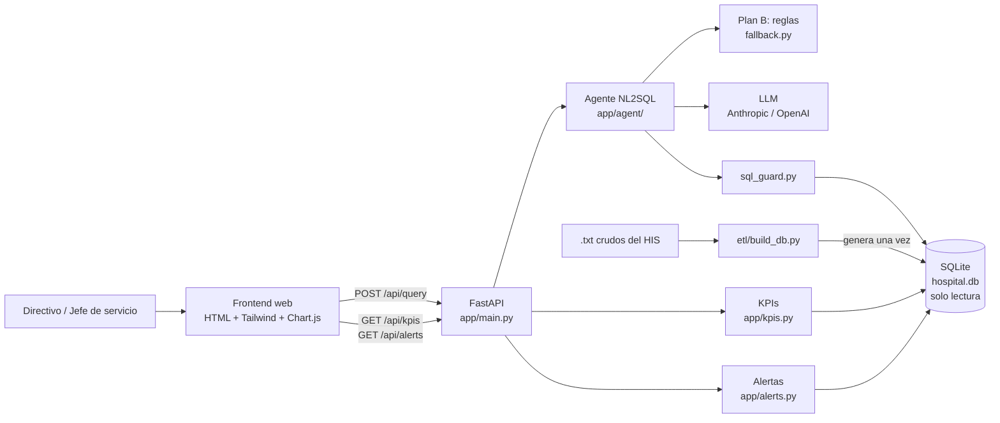
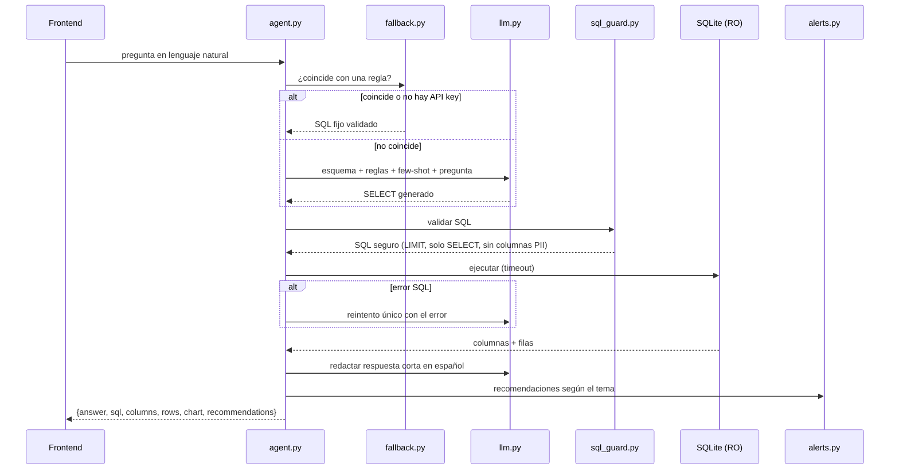
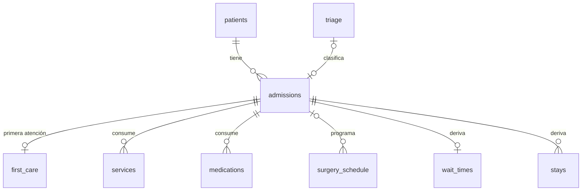

# Arquitectura — Asistente IA de Gestión Hospitalaria (HSLV)

**Decisión:** monolito modular en Python (FastAPI) que sirve la API y el frontend estático, con un agente NL2SQL
de dos rutas (reglas → LLM) sobre una base SQLite de solo lectura generada por un ETL.

Una sola aplicación, un solo proceso, un solo comando para correr. En 8 horas, cada pieza de infraestructura
extra es tiempo que no se invierte en la demo.

---

## 1. Vista general



| Capa | Responsabilidad | Módulo |
|------|-----------------|--------|
| Presentación | Chat, dashboard, tablas y gráficos | `web/` |
| API | Rutas HTTP, validación de entrada, serialización | `app/main.py` |
| Aplicación | Orquestar pregunta → SQL → datos → respuesta | `app/agent/agent.py`, `app/kpis.py`, `app/alerts.py` |
| Seguridad | Validar SQL, bloquear escritura y columnas sensibles | `app/agent/sql_guard.py` |
| Infraestructura | Conexión SQLite RO, clientes LLM | `app/db.py`, `app/agent/llm.py` |
| Datos | Limpieza y tablas derivadas | `etl/build_db.py` → `data/hospital.db` |

**Regla de dependencias:** las flechas van de izquierda a derecha. `web/` nunca toca la BD; el agente nunca lee `.txt`.

---

## 2. Flujo del agente NL2SQL (corazón del producto)



**Por qué el plan B va primero:** las 4 preguntas de la demo se resuelven por reglas, con SQL probado.
Si el LLM falla, se cae la red o se agota la cuota, la demo sigue funcionando. El LLM cubre la "cola larga".

### 2.1 Enrutamiento de intención (preguntas de datos vs. conceptuales)

| Orden | Tipo de pregunta | Cómo se detecta | Quién responde | Sin LLM |
|-------|------------------|-----------------|----------------|---------|
| 0 | Datos personales | términos como cédula, nombre, documento + paciente | rechazo | ✅ |
| 1 | Definición ("¿qué es una EPS?", "diferencia entre…") | frase de definición al inicio + término del glosario | `glossary.py` (glosario HIS oficial + indicadores del panel); el LLM solo la redacta | ✅ plantilla fiel |
| 2 | Pregunta frecuente de datos | palabras clave de `fallback.RULES` | SQL fijo verificado | ✅ |
| 3 | Saludo / ayuda | "hola", "qué puedes hacer"… | mensaje de capacidades | ✅ |
| 4 | Cualquier otra | — | LLM con esquema + glosario: responde SQL, o `TEXT:` si es conceptual | ❌ mensaje guía |

El glosario (~35 términos del PDF + 6 indicadores del panel) cabe completo en el prompt: no se necesita RAG con
embeddings. Cada respuesta cita su fuente en `sources` (glosario oficial, definiciones del panel o `hospital.db`).
"Natural" = el LLM redacta como un analista que le habla a un directivo: número clave primero, una frase de
interpretación, términos técnicos explicados, sin mencionar tablas ni SQL.

---

## 3. Contrato de la API

Este contrato es lo primero que se acuerda: permite que frontend y backend trabajen en paralelo con datos simulados.

### `POST /api/query`

```json
// Request
{ "question": "¿Cuántas camas de UCI están ocupadas hoy?" }

// Response 200
{
  "answer": "Hoy hay 27 de 46 camas de UCI ocupadas (58,7%); 73% sobre camas físicas.",
  "sql": "SELECT service, occupied_beds, ... FROM v_occupancy_daily WHERE ...",
  "source": "rules",                 // "rules" | "llm"
  "columns": ["service", "occupied_beds", "capacity_beds", "occupancy_pct"],
  "rows": [["UCI", 27, 46, 58.7]],
  "chart": { "type": "bar", "x": "service", "y": "occupied_beds" },   // bar | line | pie | none
  "recommendations": ["Ocupación física de UCI en 73%: vigilar ingresos del turno noche."]
}

// Response 400 (pregunta vacía, SQL rechazado, datos personales)
{ "error": "La pregunta solicita datos personales y no puede responderse." }
```

### Autenticación

`POST /api/auth/login` `{ "username": "admin" | "admin@hosusana.gov.co", "password": "..." }` →
`{ "access_token": "<JWT>", "token_type": "bearer", "expires_in": 28800, "user": {...} }` · 401 si falla.

`/api/query`, `/api/kpis`, `/api/alerts` y `/api/auth/me` exigen `Authorization: Bearer <token>` (401 sin él).
`/api/health` y `/api/auth/login` son públicos.

### `GET /api/kpis`

Se calcula una vez y queda en caché (datos de solo lectura; se precalienta al arrancar el servidor).

```json
{
  "reference_date": "2026-09-21",
  "cards": [
    { "id": "hospital_occupancy", "label": "Ocupación hospitalaria hoy", "value": 102.5, "unit": "%",
      "detail": "374 pacientes en 365 camas físicas · 52,5% incluyendo camas virtuales", "status": "critical" }
  ],
  "series": {
    "occupancy_daily":       { "labels": ["2026-08-23", "..."], "threshold": 90, "datasets": [{ "label": "UCI", "data": [] }] },
    "occupancy_by_service":  { "labels": [], "data": [], "occupied": [], "physical": [], "threshold": 90 },
    "surgery":               { "labels": ["2026-05"], "scheduled": [], "performed": [], "performed_pct": [] },
    "admissions_by_service": { "labels": ["Urgencias"], "data": [1169] },
    "admissions_daily":      { "labels": [], "data": [], "moving_avg_7d": [] },
    "wait_by_triage":        { "labels": ["Triage 1"], "last_7d": [], "historical": [] },
    "top_medications":       { "labels": [], "data": [] },
    "low_medications":       { "labels": [], "data": [] },
    "top_specialties":       { "labels": [], "data": [] }
  },
  "medications_table": [
    { "item_code": "...", "item_name": "...", "stock_units": 33, "avg_daily_consumption": 43.17,
      "days_of_inventory": 0.8, "expiry_date": "2026-10-15", "status": "critical" }
  ]
}
```

Tarjetas: `hospital_occupancy`, `uci_occupancy`, `avg_wait_7d`, `critical_stock`, `surgery_performed`, `admissions_month`.
`status`: `ok` | `warning` | `critical`.

### `GET /api/alerts`

```json
[
  { "type": "occupancy", "severity": "critical", "title": "Pediatría al 165,8% de ocupación",
    "detail": "63 pacientes en 38 camas físicas (165,8%): se están usando camas virtuales.",
    "action": "Habilitar camas de expansión y reasignar personal de enfermería desde Urgencias (63,1%) y UCI (73,0%)." }
]
```

`severity`: `critical` | `warning` | `info` (ordenadas así). `type`: `stock` | `expiry` | `occupancy` | `wait_time` |
`surgery` | `forecast`. `detail` explica el dato y la causa raíz; `action` es la recomendación.

| Alerta | Regla |
|--------|-------|
| Desabastecimiento | `days_of_inventory` < 5 (crítico < 2); sugiere unidades para cubrir 15 días |
| Vencimiento | vence en ≤ 30 días y el stock no alcanza a consumirse antes |
| Ocupación | ≥ 90% de camas físicas; sugiere de qué servicios (< 80%) reasignar personal |
| Espera | triage 2 > 30 min o triage 3 > histórico +20%; causa raíz por turno (día 07–19 / noche) y área |
| Cirugías | % no realizadas, peor mes y reprogramaciones |
| Predictiva | capítulo CIE-10 con +15% de ingresos/día (2 semanas vs 4 previas), ordenado por impacto absoluto; recomienda los medicamentos característicos del capítulo (mayor *lift*) |

### `GET /api/occupancy/filters` y `GET /api/occupancy`

KPI del reto "ocupación hospitalaria: promedio diario/mensual de camas ocupadas por servicio".

`/filters` → servicios (9) con sus subservicios (19) y camas, especialidades, `first_date`, `reference_date`,
`reliable_from`.

`/api/occupancy?service=UCI&sub_service=...&specialty=...&granularity=daily|monthly&start=AAAA-MM-DD&end=AAAA-MM-DD`
(servicio **o** especialidad; filtros validados contra listas conocidas, 400 `{error}` si no) →

```json
{
  "scope": { "type": "beds", "label": "UCI · UCI Neonatal" }, "granularity": "daily",
  "labels": ["2026-06-01"], "occupied": [10], "physical_pct": [66.7],
  "capacity": { "physical_beds": 15, "total_beds": 18 }, "threshold_beds": 13.5,
  "summary": { "avg": 11.4, "max": 20, "max_date": "2026-07-14", "today": 15, "days_over_threshold": 29, "days": 113 },
  "by_service": [{ "service": "Pediatría", "avg_occupied": 57, "physical_beds": 38, "avg_physical_pct": 150, "days_over_threshold": 113 }],
  "monthly_matrix": { "months": ["2026-06"], "rows": [{ "service": "UCI", "values": [21.6] }] },
  "notes": ["La capacidad es estimada…"], "incomplete_from": "2026-09-07"
}
```

**Fuente de la historia:** `v_occupancy_sub_daily`. Cada ingreso guarda solo su última cama, así que el censo por cama
subcuenta a los pacientes trasladados (UCI daba ~3 camas/día); las estancias facturadas los recuperan pero subcuentan
a quienes aún no egresan. En unidades críticas se toma la mayor de ambas (UCI ≈ 22 camas/día jun–ago). El tramo
`incomplete_from` → ayer se sombrea en el gráfico; mayo se marca como incompleto (`census_reliable_from`).

### `GET /api/health`

`{ "status": "ok", "db": true, "llm_provider": "anthropic", "reference_date": "2026-09-21" }`

---

## 3.1 Frontend (`web/`)

Sin framework ni build step (Tailwind y Chart.js por CDN, módulos ES). Detalle en [web/README.md](../web/README.md).

| Pantalla / componente | Endpoint |
|------------|--------------------------|
| Login (`index.html`) | `POST /api/auth/login` |
| 6 tarjetas KPI + 7 gráficos (Resumen) | `GET /api/kpis` → `cards`, `series` |
| "Requiere acción hoy" + pestaña Alertas con filtros | `GET /api/alerts` |
| Chat: respuesta, gráfico, tabla, SQL en `<details>`, recomendaciones | `POST /api/query` |
| Medicamentos: rotación mayor/menor + tabla con buscador | `GET /api/kpis` → `series.*_medications`, `medications_table` |

FastAPI sirve `web/` en `/` y la API en `/api/*`: mismo origen, sin CORS.

---

## 4. Patrones de diseño aplicados

| Patrón | Dónde | Para qué |
|--------|-------|----------|
| **Factory** | `llm.py` → `get_llm_client()` según `LLM_PROVIDER` | Cambiar Anthropic/OpenAI/ninguno sin tocar el agente |
| **Strategy** | Reglas vs LLM en `agent.py` | Misma interfaz (`question → sql`), dos implementaciones |
| **Guard / Validator** | `sql_guard.py` | Punto único de control de seguridad antes de ejecutar |
| **Pipeline** | `agent.py` | Pasos explícitos y testeables: resolver → validar → ejecutar → redactar → recomendar |
| **MVC (liviano)** | Modelo = SQLite + consultas; Controlador = FastAPI; Vista = `web/` | Separación exigida por el reto |
| **Read model** | Tablas/vistas derivadas del ETL | Los KPIs se consultan, no se recalculan en cada request |

---

## 5. Seguridad y privacidad

| Riesgo | Control |
|--------|---------|
| SQL destructivo o inyección | Una sola sentencia; debe iniciar con `SELECT`/`WITH`; lista negra `INSERT/UPDATE/DELETE/DROP/ALTER/ATTACH/PRAGMA/CREATE` |
| Escritura accidental | Conexión `file:data/hospital.db?mode=ro` |
| Consultas costosas | `LIMIT 200` forzado + timeout |
| Fuga de datos personales | Columnas prohibidas en el resultado: `patient_id`, `birth_date`, `diagnosis_name`, `diagnosis_code`, `bed_code`, `bed_name`. El ETL ya eliminó nombre y motivo de consulta |
| Credenciales expuestas | Solo en `.env` (en `.gitignore`); se entrega `.env.example` |
| Pregunta pide datos personales | El prompt instruye negarse; el guard lo bloquea aunque el LLM no lo haga |
| Acceso a la app | Login real: credenciales en `.env` (`AUTH_USERNAME`, `AUTH_PASSWORD`), comparación en tiempo constante, token JWT HS256 firmado con `AUTH_SECRET`, vigencia 8 h. Todo `/api/*` salvo login y health exige token. Pendiente para producción: usuarios en BD con hash de contraseña, roles y límite de intentos |

Diagnósticos solo se muestran **agregados por capítulo CIE-10** (`diagnosis_chapter`), nunca por paciente.

---

## 6. Modelo de datos (resumen)

Detalle completo en [CLAUDE.md §3](../CLAUDE.md). Relaciones principales:



Tablas derivadas que usa el agente antes que recalcular: `v_occupancy_daily`, `wait_times`, `drug_inventory`,
`stays`, `v_admissions_safe`. "Hoy" = `dataset_meta.reference_date` (2026-09-21), nunca `date('now')`.

---

## 7. Despliegue

| Entorno | Cómo | Estado |
|---------|------|--------|
| Local (obligatorio) | `uvicorn app.main:app` sirve API + `web/` | Plan principal de la demo |
| Nube (opcional) | Render/Railway, BD generada en el build | Solo si sobra tiempo |

---

## 8. Limitaciones conocidas (se dicen en la demo)

- Inventario **simulado** (stock y vencimiento); el consumo diario sí es real.
- Capacidad de camas **estimada** por camas distintas observadas.
- El servicio del ingreso es la cama registrada; los traslados internos no se ven.
- Cirugías sin fecha ni quirófano; solo 31% cruza con ingresos. "Realizada" = procedimiento cobrado.
- Septiembre incompleto (hasta el día 21).
