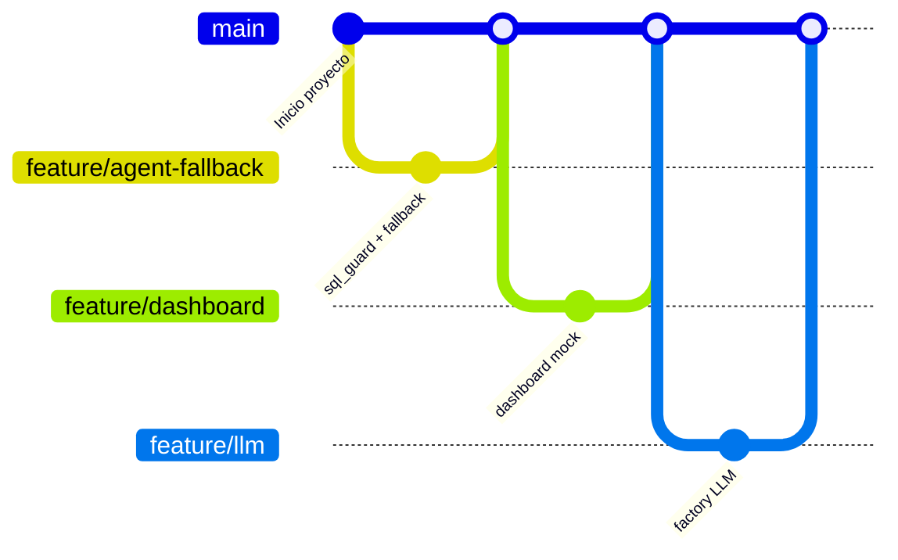

# Metodología de trabajo — equipo de 3 personas, ~8 horas

**Decisión:** Scrum comprimido en 3 mini-sprints, organizado con las fases de Design Thinking que propone el reto
(**Idear → Prototipar → Testear → Presentar**). Tablero en GitHub Projects y ramas `feature/*` → `main`.

La idea central: **tener algo demostrable desde la hora 2** y mejorarlo por capas. Nunca un "big bang" al final.

---

## 1. Roles

Cada persona es dueña de un módulo, pero todos pueden ayudar en otro cuando el suyo está bloqueado.

| Rol | Persona | Es dueño de | Entregable clave |
|-----|---------|-------------|------------------|
| **A — Agente IA / Backend** | _(nombre)_ | `app/agent/*`, `app/db.py`, `POST /api/query` | Las 4 preguntas responden bien, con reglas y con LLM |
| **B — Datos, KPIs y Alertas** | _(nombre)_ | `etl/`, `app/kpis.py`, `app/alerts.py`, `GET /api/kpis`, `GET /api/alerts` | Números validados contra la tabla de la demo; alertas explicables |
| **C — Frontend y Presentación** | _(nombre)_ | `web/*`, README, diagrama, guion de demo | Dashboard + chat funcionando; presentación ensayada |

Roles Scrum (livianos):

| Rol Scrum | Quién | Qué hace |
|-----------|-------|----------|
| Product Owner | C | Mantiene el foco en la demo y prioriza el tablero |
| Scrum Master / Integrador | A | Corre los sync, resuelve bloqueos y hace los merges a `main` |
| Guardián de datos | B | Aprueba cualquier cambio al ETL y valida cifras |

---

## 2. Cronograma

| Bloque | Hora | Fase | Objetivo | Resultado verificable |
|--------|------|------|----------|------------------------|
| Kickoff | 0:00–0:30 | Idear | Leer CLAUDE.md, instalar entorno, generar BD, acordar contrato API | Los 3 corren el ETL y ven `hospital.db` |
| Sprint 1 | 0:30–2:30 | Prototipar | **Esqueleto que camina** sin LLM | `/api/query` responde las 4 preguntas por reglas; frontend muestra datos mock |
| Sprint 2 | 2:30–5:00 | Prototipar | LLM + KPIs reales + frontend conectado | Chat y dashboard con datos reales de la BD |
| Sprint 3 | 5:00–6:30 | Testear | Alertas, recomendaciones, privacidad, pulido | Panel de alertas; preguntas con PII rechazadas |
| Cierre | 6:30–8:00 | Presentar | **Congelar código**, README, video de respaldo, ensayo | Demo ensayada 2 veces de punta a punta |

> **Regla de congelamiento:** después de las 6:30 solo se corrigen errores. Cero funcionalidades nuevas.

---

## 3. Tareas por sprint

### Sprint 1 — Esqueleto (0:30–2:30)

| Rol | Tareas |
|-----|--------|
| A | `db.py` (conexión RO) · `sql_guard.py` · `fallback.py` con las 4 preguntas · `POST /api/query` |
| B | Validar las cifras de las 4 preguntas en SQLite · `kpis.py` con las 4 tarjetas · `GET /api/kpis` |
| C | Maqueta `index.html` (dashboard + chat) con Tailwind · `app.js` consumiendo JSON mock del contrato |

### Sprint 2 — Inteligencia (2:30–5:00)

| Rol | Tareas |
|-----|--------|
| A | `schema_prompt.py` (esquema + few-shot) · `llm.py` (factory) · reintento con error · redacción de respuesta |
| B | Series para gráficos (ocupación diaria, ingresos por servicio, top medicamentos) · ~10 reglas extra para `fallback.py` |
| C | Conectar a la API real · tabla de resultados · gráfico dinámico según `chart` · SQL colapsable |

### Sprint 3 — Valor añadido (5:00–6:30)

| Rol | Tareas |
|-----|--------|
| A | Pruebas de seguridad (PII, `DROP`, múltiples sentencias) · manejo de errores amigable |
| B | `alerts.py` (stock, vencimiento, ocupación, espera, cirugías) · causa raíz de espera por turno · predicción si hay tiempo |
| C | Panel de alertas · estados de carga/error · capturas y diagrama para README |

---

## 4. Ritmo de coordinación

| Ceremonia | Cuándo | Duración | Formato |
|-----------|--------|----------|---------|
| Sync | Cada hora en punto | 5 min | ¿Qué terminé? ¿Qué sigue? ¿Qué me bloquea? |
| Revisión de sprint | Al cierre de cada sprint | 10 min | Demo interna en la máquina del integrador |
| Retro relámpago | Tras Sprint 2 | 5 min | Una cosa a dejar de hacer, una a mantener |

Si algo bloquea más de **15 minutos**, se avisa en el momento; no se espera al siguiente sync.

---

## 5. Flujo de Git

| Regla | Detalle |
|-------|---------|
| Ramas | `feature/<tema>` desde `main` (ej. `feature/agent-fallback`, `feature/kpis`, `feature/dashboard`) |
| Commits | Pequeños y frecuentes, Conventional Commits: `feat:`, `fix:`, `docs:`, `refactor:`, `test:`, `chore:` |
| Integración | Merge a `main` al menos una vez por sprint; lo hace el integrador tras verlo funcionar |
| Conflictos | Cada rol toca sus propios archivos; `app/main.py` es compartido: cambios cortos y avisados |
| Prohibido subir | `.env`, `data/*.db`, `__pycache__/`, `.venv/` |

---

## 6. Tablero (GitHub Projects)

Columnas: **To Do → Doing → Done**. Cada tarjeta tiene rol responsable y criterio de aceptación.
Máximo **2 tarjetas en Doing por persona**.

---

## 7. Definición de Hecho (DoD)

Una tarea está terminada cuando:

- [ ] Corre en local desde `main` sin pasos manuales ocultos.
- [ ] No expone columnas sensibles ni credenciales.
- [ ] Las 4 preguntas de la demo siguen devolviendo las cifras esperadas.
- [ ] El código tiene nombres en inglés y comentarios donde la lógica no es obvia.
- [ ] Está integrada a `main` y la tarjeta pasó a Done.

---

## 8. Riesgos y plan de contingencia

| Riesgo | Probabilidad | Mitigación |
|--------|--------------|------------|
| Sin red o sin cuota de API en la demo | Media | Plan B por reglas cubre las 4 preguntas; `LLM_PROVIDER=none` |
| El LLM genera SQL incorrecto | Alta | Few-shot con las 4 preguntas, reintento con el error, reglas primero |
| Integración tardía rompe todo | Media | Contrato API acordado en el kickoff; merges por sprint |
| Falta un archivo crudo | Resuelto | `Ingresos.txt` agregado; ETL validado y las 4 preguntas coinciden con lo esperado |
| Datos crudos pesados en el repo | **Confirmado** | Los `.txt` ya están versionados; decidir si se retiran del historial |
| Se acaba el tiempo | Alta | Congelamiento a las 6:30; extras solo si sobra tiempo |

---

## 9. Guion de la presentación

1. **Problema:** información fragmentada que retrasa decisiones (30 s).
2. **Solución:** agente NL2SQL + dashboard + alertas (30 s).
3. **Arquitectura:** diagrama de componentes (1 min).
4. **Demo en vivo:** las 4 preguntas, mostrando SQL, gráfico y recomendación (3 min).
5. **Alertas y valor añadido:** desabastecimiento, ocupación, causa raíz (1 min).
6. **Limitaciones y mejoras:** dichas con honestidad (1 min).
